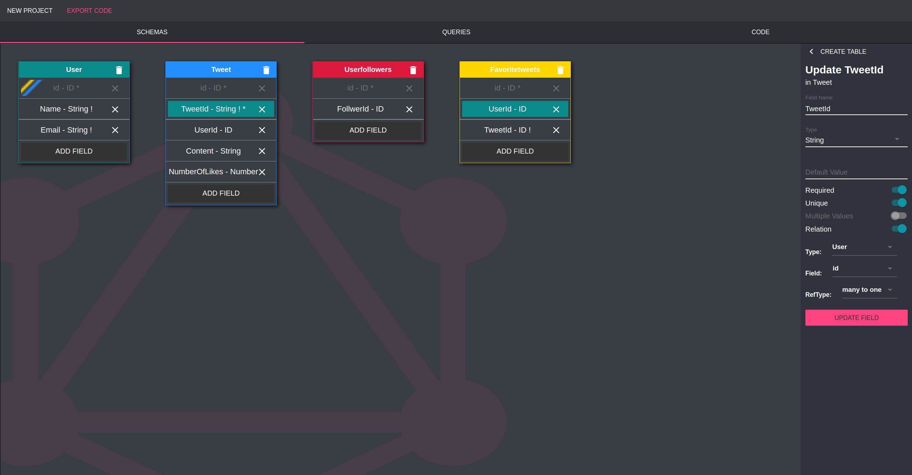
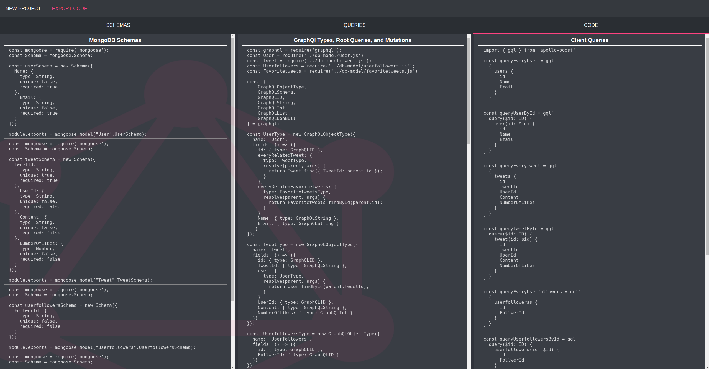
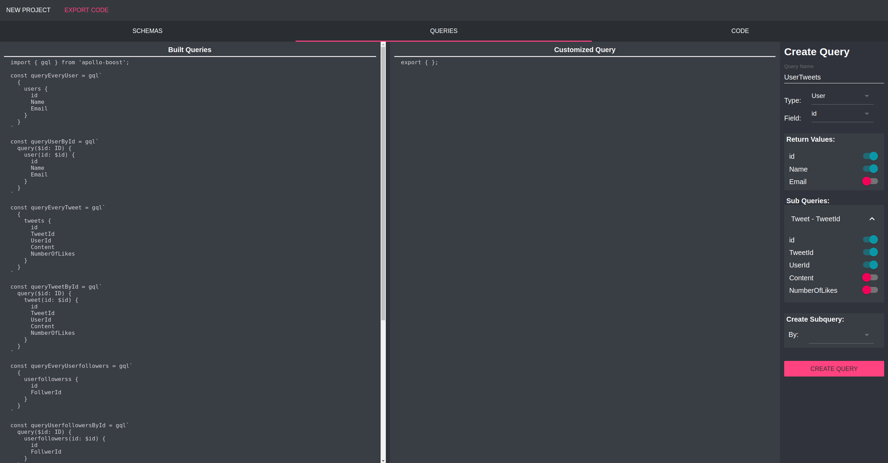

# graphqldesigner.com 
A user friendly Graphql designer aimed to simplify creation and implementation of a full stack React Graphql app.

##Background

GraphQL is an emerging open source data query and manipulation language that is becoming the preferred method over RESTful architecture, fulfilling queries with just one API call, with no overfetching or underfetching of data.  Although GraphQL is on the rise, the entry barrier is relatively high and benefits become costly to developers. Designing an application with GraphQL  and manually setting up schemas varying in complexity, depending on the backend architecture, becomes time consuming and redundant.

GraphQL Designer solves these problems by allowing developers to build their database and queries through an interactive interface and with a touch of a button, export their database and customized queries code to be used in their project environment.

##How To Use 

Visit https://www.graphqldesigner.com and choose a database model to implement (MongoDB or MySQL). Create tables that will represent your database schemas and GraphQL types. Each table consists of fields, which not only becomes a GraphQL field, but a SQL column or NoSQL key as well.

The fields can be customized to meet your desired database structure, and using relations, can dynamically make the resolvers for each GraphQL type. By default at this point, our application can auto generate a server file, database setup code, and GraphQL types, root queries, mutations, and client queries.

For more particular client queries, you can customize client queries in addition to the default generated ones. 

Lastly export your code! 

##Authors
Patrick Slagle
Greg Shamalta
James Sieu
Tsion Adefres

Use npm run dev for hot module reloading 

**To start the server, run: npm install, npm run pack and then npm run server.
