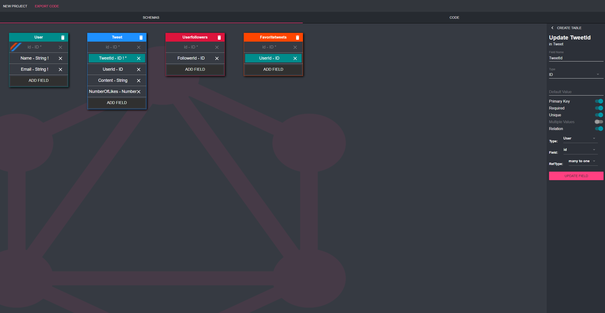
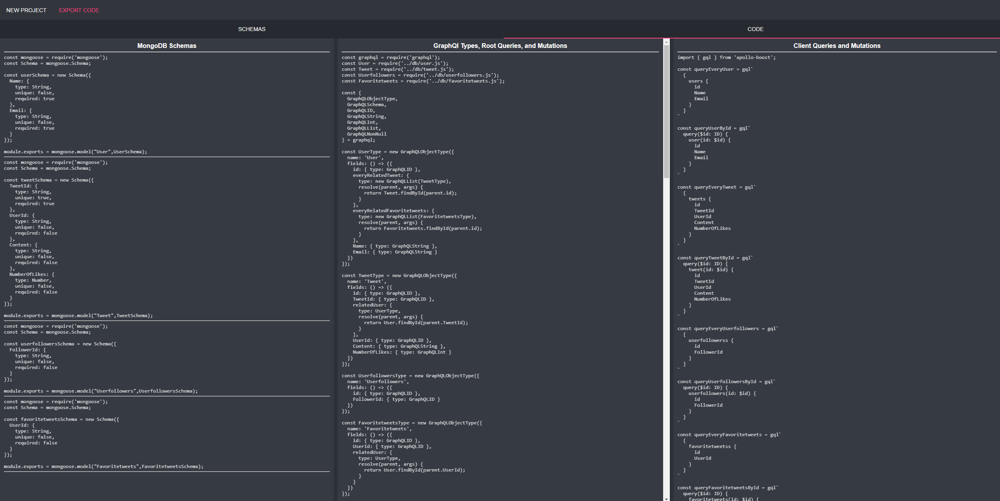

# GraphQL Designer 

[GraphQL Designer](http://graphqldesigner.com/) is a prototyping tool to develop full-stack GraphQL applications.

With a few simple inputs, GraphQL Designer auto generates code for download, to start and implement your new application including GraphQL root queries, schemas, mutations, and client queries. Also available for download are the NoSQL schemas or SQL build scripts, and a server file.


## Background

GraphQL is an emerging open source data query and manipulation language that can be a preferred method over RESTful architecture, fulfilling queries with less API calls, and limiting over-fetching and under-fetching of data. Although GraphQL is a powerful query language, starting a new GraphQL application can be time consuming due to its redundant structure. This repetitive code can make developing a GraphQL application more intuitive, but this could also mean that for every GraphQL type created, a large amount of additional code would be required.

For example, adding a new GraphQL type "User" with the fields "id", "age", and "messages" may require the following:
- A root query for an individual User by id
- A root query for all the Users
- Mutation to create a User with an id, age, and messages
- Mutation to select a User by id, and update their age or messages
- Mutation to delete a User by id
- Client queries for User and the particular fields
- A NoSQL schema or SQL create script for User

You will notice that all these items revolve around a similar piece of information - User and its fields: id, age, and messages.

GraphQL Designer solves this repetition by requiring the developer just to enter the information once. Once a GraphQL type is created on this platform, root queries, mutations, client queries, and a NoSQL schema or SQL create script is auto generated and ready for download. After download, the code can be simply dragged and dropped into your code base or favorite text editor!

## How To Use

Visit [GraphQL Designer](http://graphqldesigner.com/) and choose a database model to implement (MongoDB or MySQL). Based on the database selected, our application will generate the code for your database schemas or build scripts and GraphQL resolvers.

Next create a table for every GraphQL type your application will need. Each table created will also represent the structure of your NoSQL schema or SQL table. Each created table in our application can have several fields, which not only becomes a GraphQL field, but a SQL column or NoSQL key as well.



The fields can be customized to meet your desired database structure, and using relations, can dynamically make the resolvers for each GraphQL type. By default at this point, our application can auto generate a server file, database setup code, and GraphQL types, root queries, mutations, and client queries.



Lastly export your code!

## Authors

[James Sieu](https://www.linkedin.com/in/james-sieu/) [@jamessieu](https://github.com/jamessieu)

[Patrick Slagle](https://www.linkedin.com/in/patrickslagle/) [@patrickslagle](https://github.com/patrickslagle)

[Greg Shamalta](https://www.linkedin.com/in/gregory-shamalta/) [@grs83](https://github.com/grs83)

[Tsion Adefres](https://www.linkedin.com/in/tadefres/) [@Tsionad](https://github.com/Tsionad)

## Running Your Own Version

Use `npm run dev` for hot module reloading

To start the server:
```
npm install
npm run pack
npm run server
```

## License

This project is licensed under the MIT License - see the [LICENSE.md](https://github.com/GraphQL-Designer/graphqldesigner.com/blob/master/LICENSE.md) file for details.
